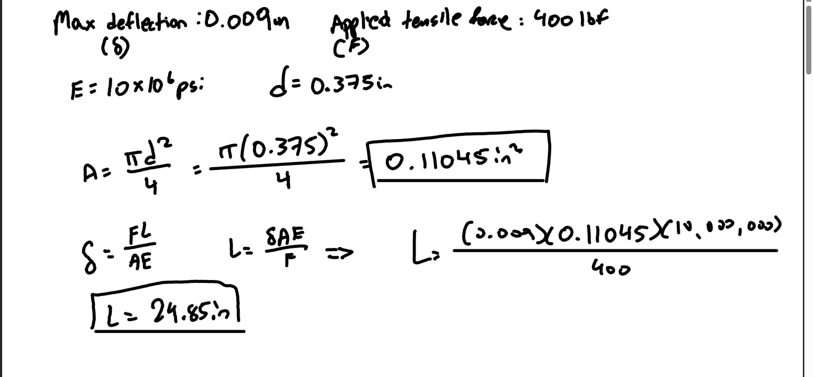
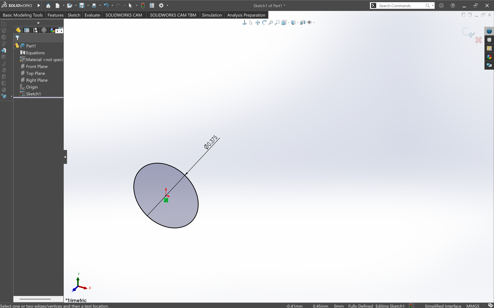
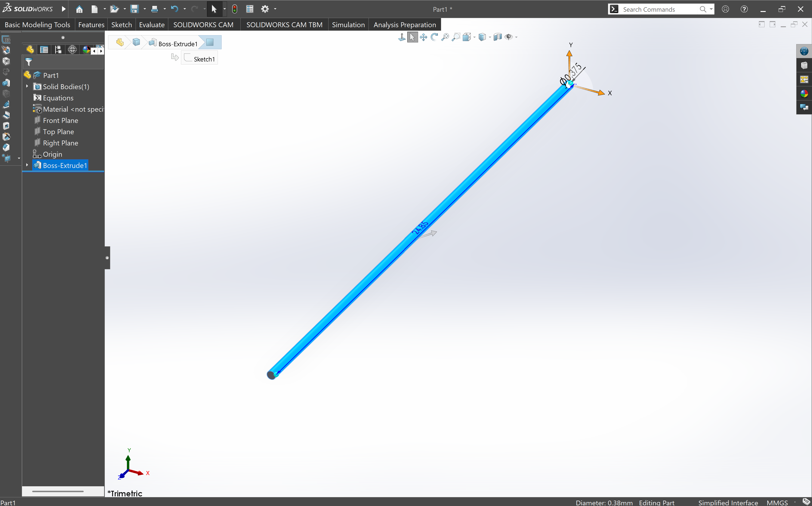
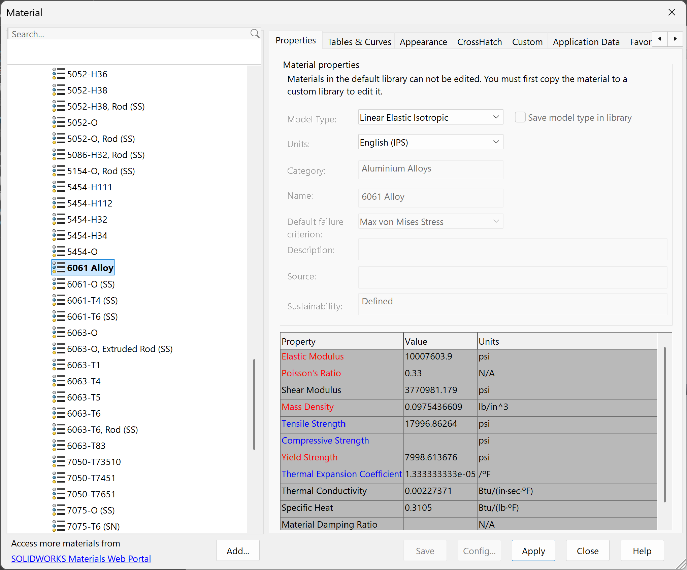
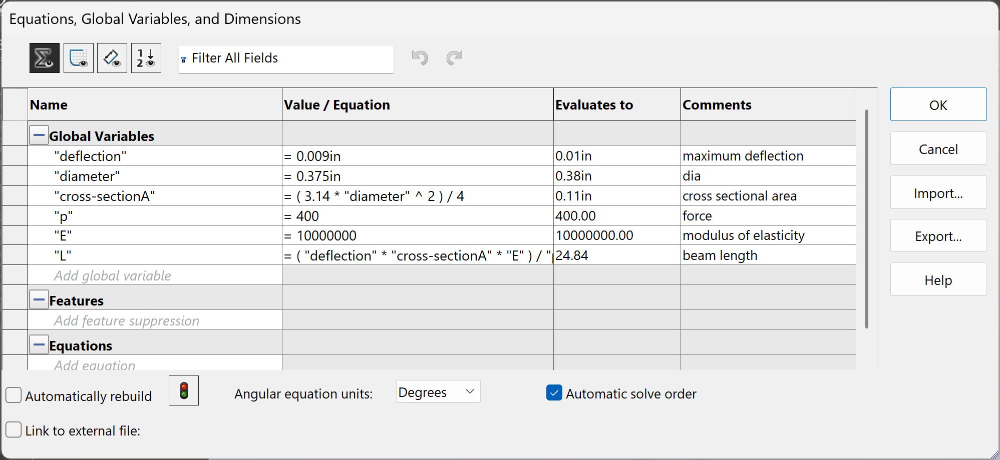
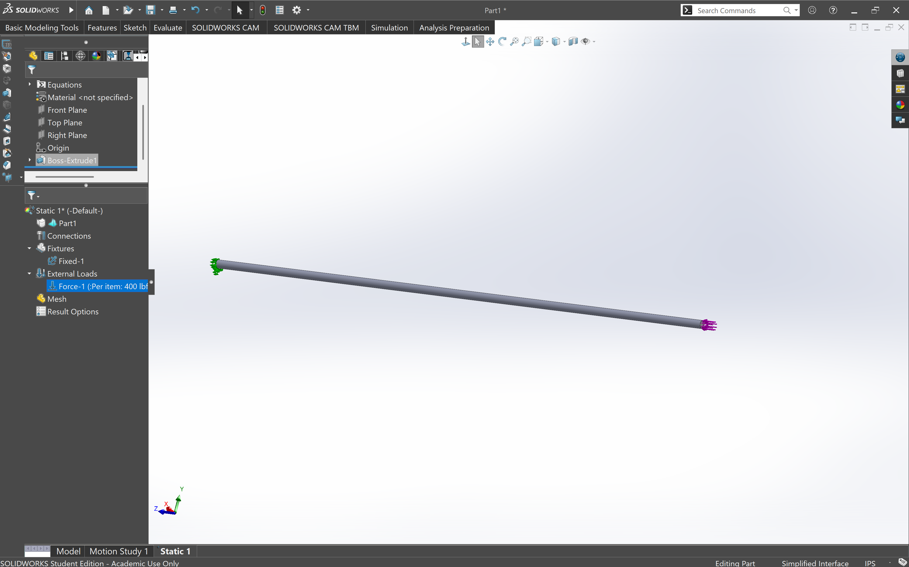
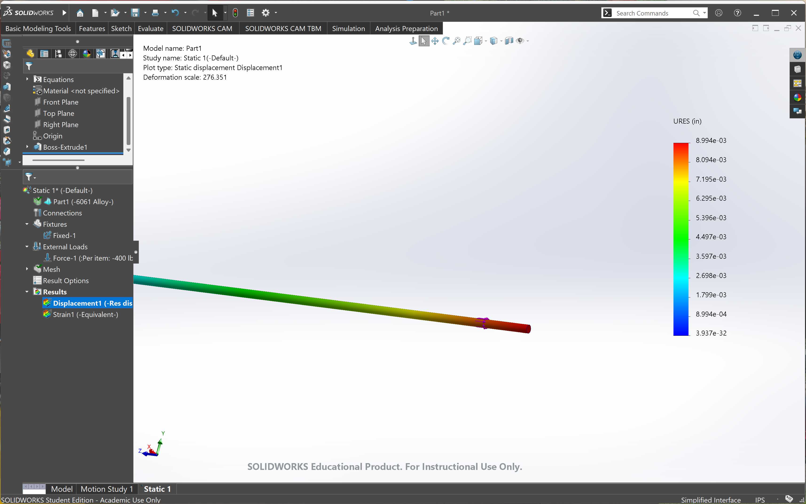
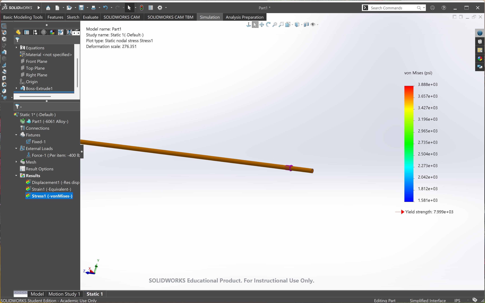
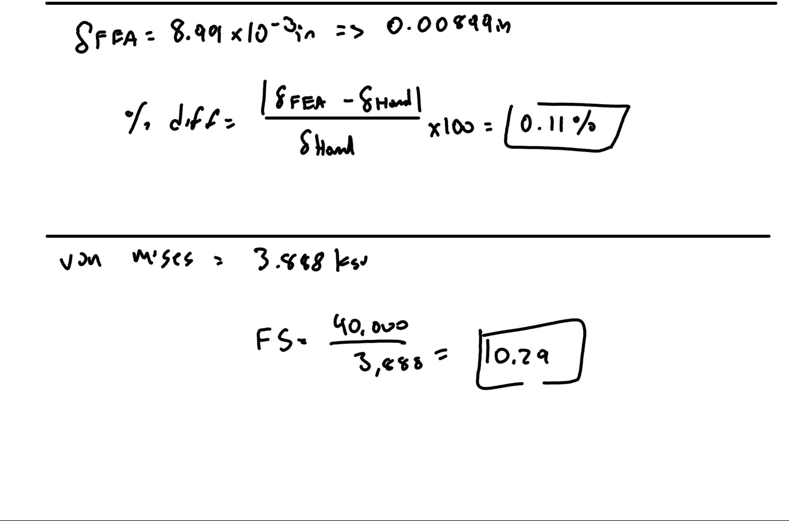
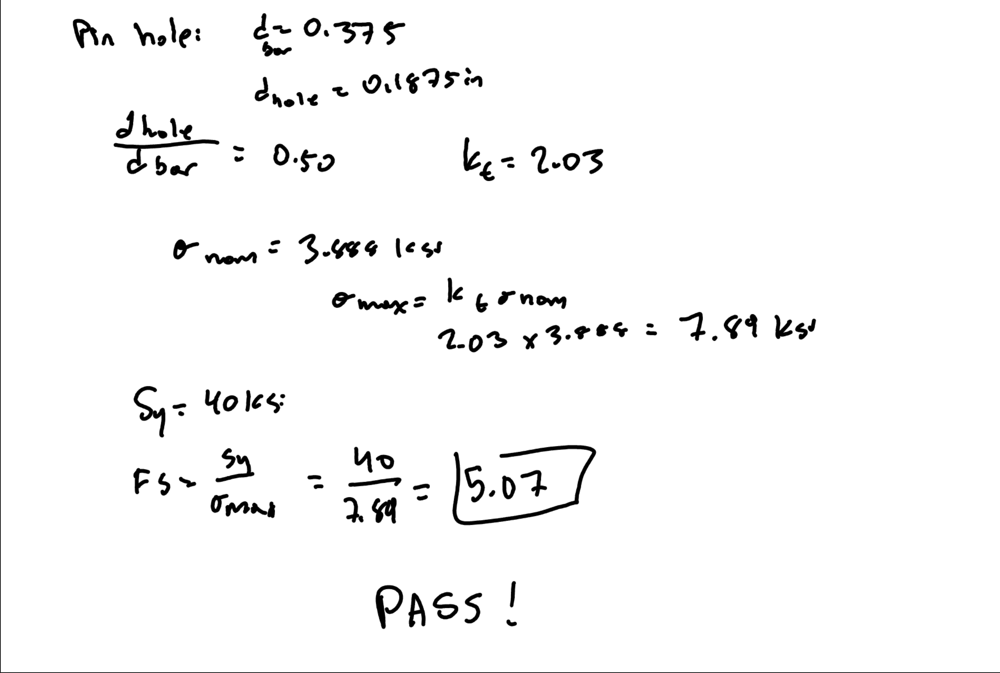

# A3 – Finite Element Analysis

## Objective
Use axial deflection modeling to design its dimensions

Use parametric design to determine a bars length

Introduce you to FEA (Finite Element Analysis)

Introduce you to linking dimensions to appropriate parameters in CAD.

Compare and contrast the different analysis

## Description 
Design a bar which has a circular cross section where the values of the criteria given for the material, maximum deflection, and load. Determine the bar’s minimum geometry through parametric design while under direct tension. Then verify the geometry through finite element analysis. Maximum deflection allowed for this assignment is 0.009 inches.

## Analyze
For the parametric design, we were allowed to choose our diameter, force, and Young's Modulus so I decided to go with 0.375in diameter, 400lbf, and 10x10^6 psi. I chose these values because I believe they would be simple enough to not make silly errors.
I started out by using the formula A = pi*d^2 / 4 to find the area. The value I got was 0.11045in^2. After that I used deflection = FL/AE. I rearranged the equation to solve for length and got L = 24.85in. Once I got these values, I started on my design.

## CAD Design

Once I had my dimensions, I started with a simple sketch of a circle with the diameter of 0.375in and then I used the calculated length of 24.85in. After that was all modeled up, it was time to choose a material that would coincide with my Modulus of Elasticity. Since I chose 10000000psi, I wanted something that would be as close to that as possible. This ended up being 6061 Alloy which was 10007604psi. Adding the global equations was the next step and that helped verify that all my previous calculations were correct. 

Now it was time for the FEA. I went into 'Simulate' and fixed the left side of the beam to a wall. Then, I moved on to the right side and selected the far right surface and added a force of 400lbf going outward. Once this was done, I ran the simulation to see what I would get as my deflection. After the simulation was over, I was left with a deflection of 0.00899in. This was nearly identical to the one given to us in the problem description. I found the % difference by using the formula: |def_fea - def_hand| / def_hand * 100. This led me to getting a 0.11% difference. The Von Mises that I got from the FEA was 3.888ksi. This was under the Sy = 40ksi that the problem gave. Using both of these values, I got a Factor of Safety of 10.29.

## Hypothetical Pin Hole

The assignment asks us to imagine a substantial pin hole on the left side of the bar and estimate the resulting peak stress without rerunning the FEA. I used a diameter of 0.1875in for the hole. I divided this by the diameter of the bar to get 0.5. Using Kt = 2.03 and the nominal stress from the Von Mises, I got a max stress of 7.89ksi which I then used to calculate the Factor of Safety. This remains under the yield strength. With these values, I was able to get a Factor of Safety of 5.07. 

## Result Reflection
The FEA result was nearly identical to the analytical result. The difference was only 0.11%, which indicates that the simulation accurately represented the simple axial loading condition. I have a high level of confidence in both results because they independently produce nearly the same displacement. For this particular problem, I would trust the analytical result as the baseline theoretical solution, while the FEA provides a useful numerical verification of the design.

The maximum von Mises stress was 3.888 ksi, which is significantly below the specified 40 ksi yield strength. This resulted in a factor of safety of 10.29.

Even after considering the hypothetical stress concentration caused by a substantial pin hole, the estimated peak stress was approximately 7.89 ksi and the factor of safety remained approximately 5.07.

Overall, the design satisfies both the stiffness and strength requirements.

## Challenges and Lessons Learned 

One challenge I encountered during this assignment was determining how to translate the analytical equations into a parametric CAD model. I had to make sure that the cross-sectional dimensions, material properties, force, and deflection requirement were correctly connected to the equations used to determine the bar length. One of the most useful parts of the assignment was comparing the analytical solution with the FEA result. The 0.11% difference showed me that FEA can closely match a theoretical solution when the model and boundary conditions accurately represent the assumptions of the analytical equation. I learned how analytical equations can be incorporated into a parametric CAD model rather than simply using fixed dimensions. This allows the design to automatically change when parameters such as force, diameter, material stiffness, or allowable deflection are changed.

## CAD File

