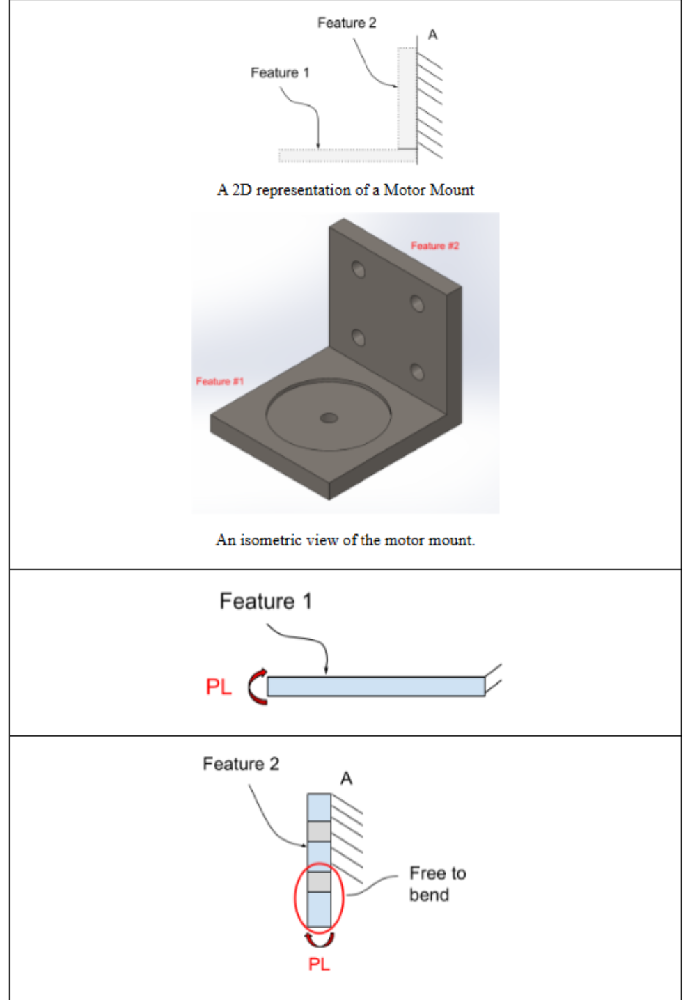
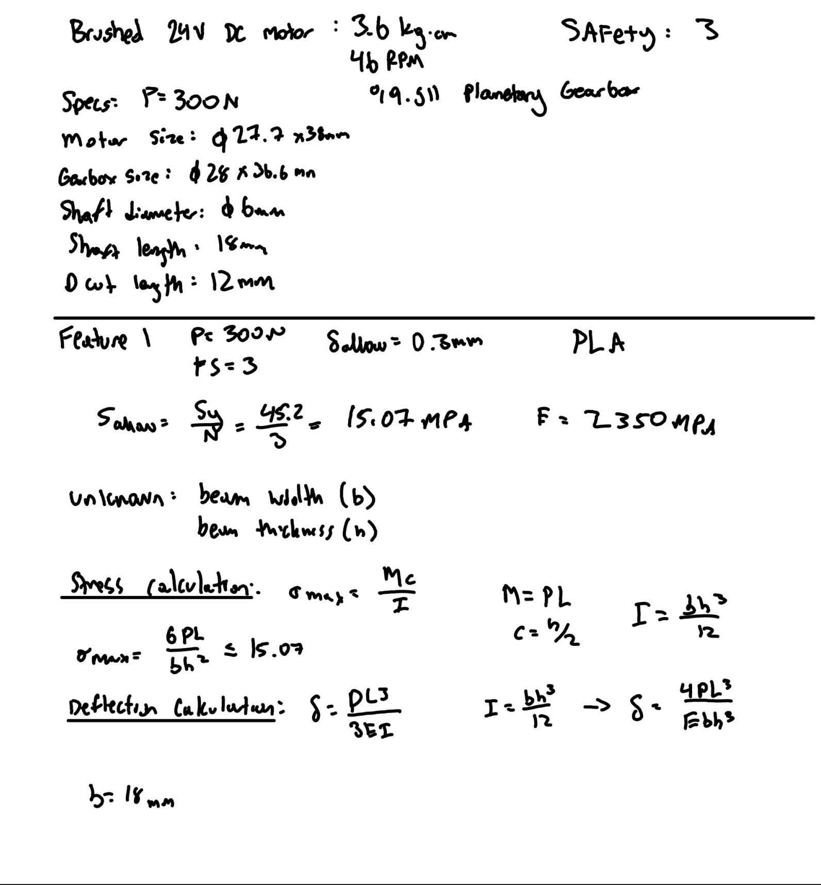
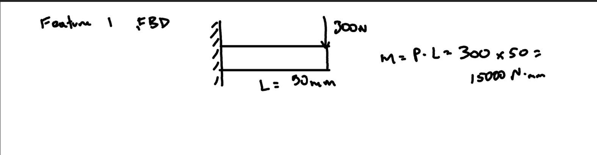
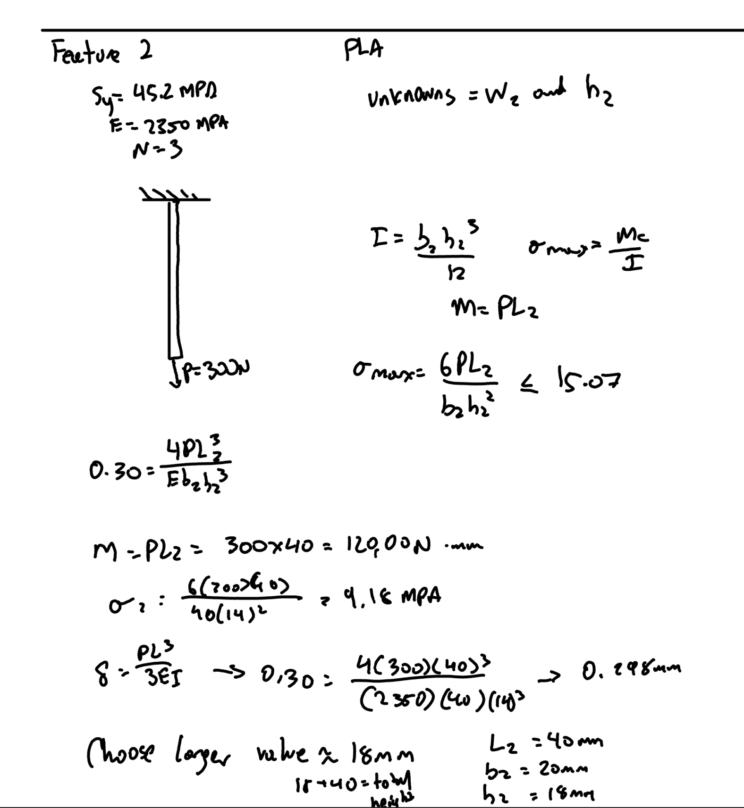
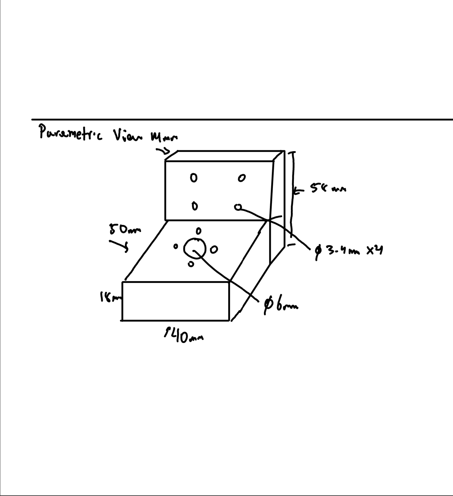
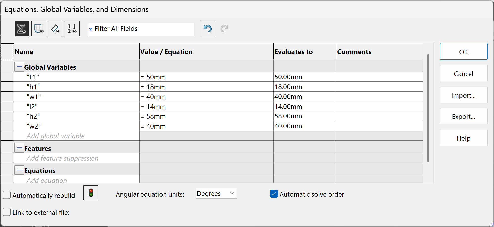
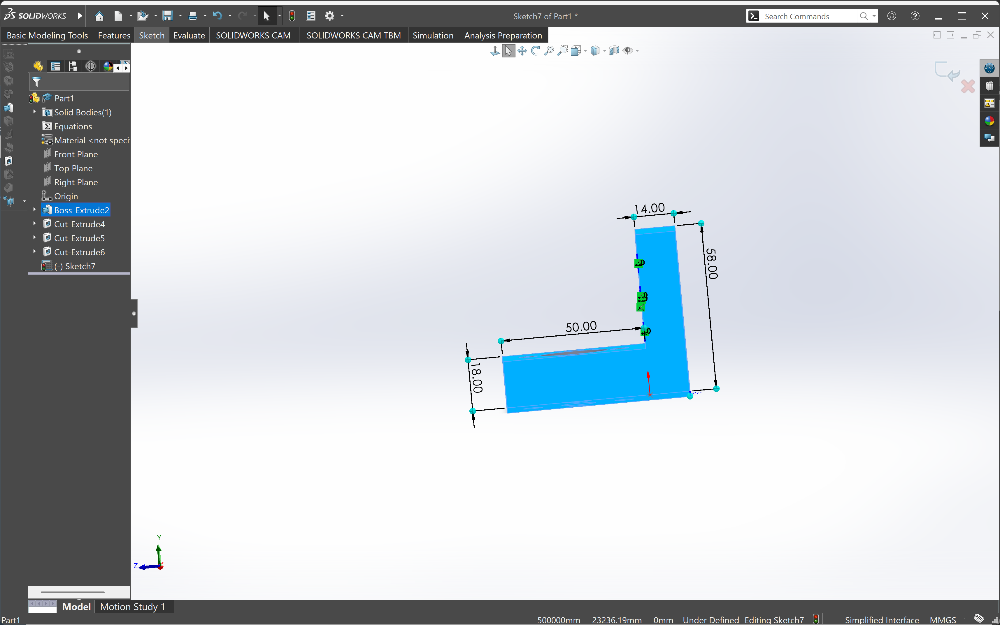
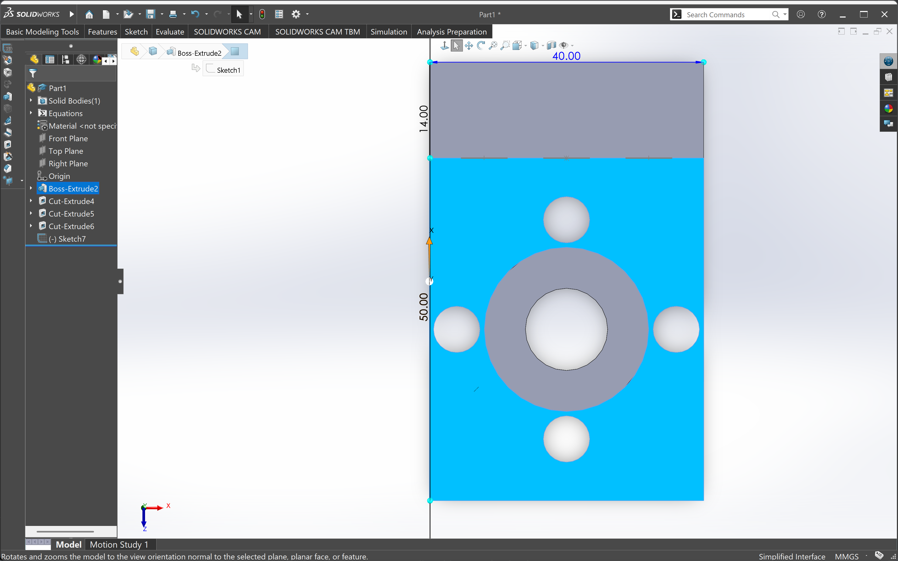
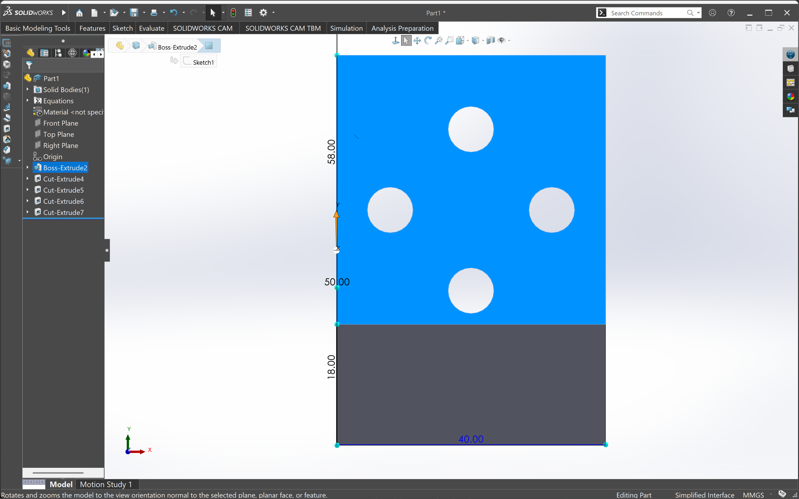
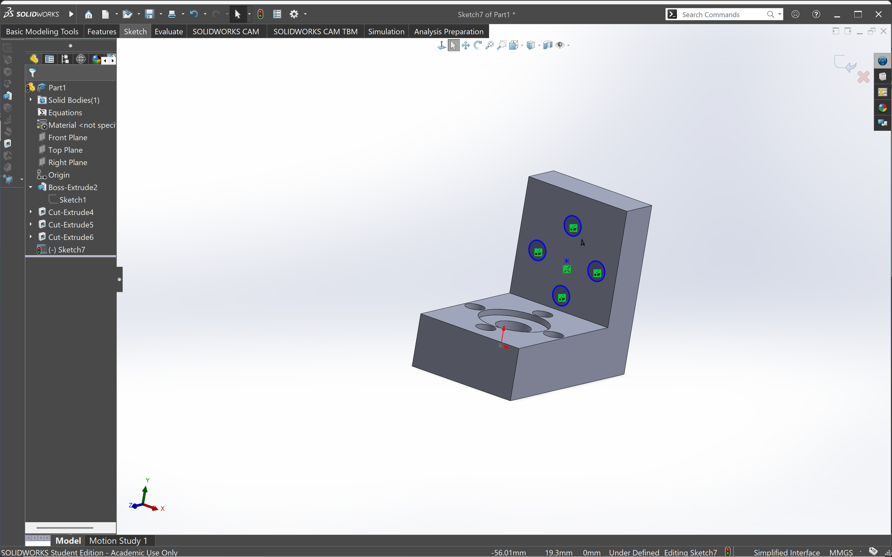

# A4 – Motor Mount

## Objective
Design a motor mount using the (Brushed 24V DC Gear Motor 3.6Kg.cm/46RPM w/ 99.5:1 Planetary Gearbox) HERE which attaches to the rigid wall A. For both features, first design for yield strength and then design for a maximum deflection of .30 mm at the free end. You may select ABS, PETG, or PLA as a motor mount material. When designing the motor mount take into account a safety factor of 3 and neglect the weight of the motor. For steps 1 and 2 draw a FBD of the forces and a concept of your design. Research the design of different motor mounts and place the links in an appendix on your page. Make justifiable approximations in your design to simplify your analysis. (ie. use the beam calculations) Follow Appendix B for the initial approach to set up the design analysis.

## Analyze ##Feature 1
I started out by looking at appendix B to see what the design is supposed to look like. The motor mount was designed to support a 300 N applied load while maintaining a maximum deflection of 0.30 mm. The weight of the motor was neglected as specified in the assignment. PLA was selected as the material for the design. The material properties used for the calculations were a yield strength of 45.2 MPa and an elastic modulus of 2350 MPa. A safety factor of 3 was used to determine the allowable stress. Using the equation for allowed stress = Sy/N , I was able to get 15.07 MPa.

Feature 1 was modeled as a horizontal cantilever beam fixed at the wall. The applied load was assumed to be 300 N at the free end. The beam length I selected was 50 mm and the beam width was selected as 40 mm. The required beam thickness was determined using the bending stress and deflection equations. Using my calculations I got a max stress of 6.94 MPa which is means that it will work for this design. My calculation for the deflection netted me 0.273mm which is below the max of 0.300mm. 

## Analyze ##Feature 2

Feature 2 was modeled as a vertical cantilever beam attached to the wall. The vertical beam length was selected as 40 mm, while the beam width was selected as 40 mm. The required horizontal thickness was determined using the same bending stress and deflection approach used for Feature 1. I used the same modulus of elasticity and the same yield strength. After calculations, I got a stress of 9.18MPa and a deflection of 0.298mm which both fit my criteria. I also drew the FBD which was a vertical part instead of horizontal like feature 1 was. 

After completing the beam analysis, an isometric sketch was created to visualize the overall motor mount geometry before creating the CAD model. The selected dimensions were transferred from the analytical calculations to the sketch.

## CAD
I first started with labeling my global equations and then got started with the CAD. The side profile of the motor mount was created in SolidWorks using the dimensions obtained from the beam calculations. The horizontal Feature 1 length was set to 50 mm, Feature 1 thickness was set to 18 mm, Feature 2 length was set to 40 mm, and Feature 2 thickness was set to 14 mm. The overall extrusion width was set to 40 mm.

The completed side profile was then extruded 40 mm to create the three-dimensional motor mount geometry.
Then clearance holes were incorporated into the design for the mounting hardware. The specified clearance-hole diameter was 3.4 mm with the middle hole being 6 mm.

The final parametric CAD model combines the calculated beam dimensions with the required mounting features. The primary dimensions were maintained from the analytical design, while additional geometry was added to create a practical motor mount.

## Lessons Learned
This assignment taught me that engineering design is not just about putting numbers into equations and getting an answer. A major part of the process is understanding how those numbers affect the physical design and making sure that the calculations, sketches, and CAD model all agree with each other. One of the biggest things I learned was how sensitive a design can be to relatively small changes in dimensions or assumptions. At the beginning of the assignment, I had one set of dimensions for the motor mount, but after looking more closely at the orientation of the two features and changing the width of the mount, I had to go back and recalculate the required dimensions. This showed me that changing one part of a design can affect many other parts of the design. Another thing I learned was that selecting a dimension should not be done blindly. Once the theoretical minimum dimension was calculated, I had to choose a practical dimension that could be used in the CAD model. For example, the calculated Feature 1 thickness was approximately 17.45 mm, so I selected 18 mm. Similarly, the calculated Feature 2 thickness was approximately 13.96 mm, so I selected 14 mm. This showed me how engineering calculations are often used to determine a minimum requirement, while the final design uses a practical value that satisfies that requirement.

This assignment took me 5 hours to complete.

## CAD FILE
[Motor Mount File](motormount.SLDPRT)

## Communicate

