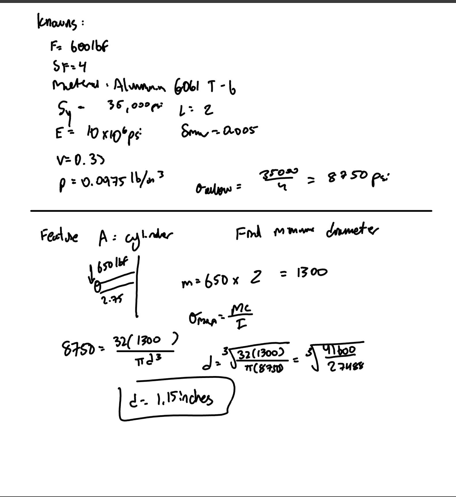

# A5 – Bracket Design

## Objective
Conduct stress analysis to determine appropriate dimensions for structural features.
Generate free body diagrams (FBDs) to visualize forces and constraints for each feature.\
Identify and document known and unknown variables, assumptions, and algebraic models for stress calculations.
Perform stiffness analysis to establish minimum required dimensions based on deflection constraints.
Compare stress and stiffness analyses to ensure structural integrity and compliance with given constraints.
Create detailed multiview sketches illustrating dimensions derived from both stress and stiffness analyses.
Reflect on and document key engineering lessons learned throughout the process.

## Description
Detail design a bracket, using the concept design in Appendix B, to hold a horizontal force applied symmetrically by a strap outline in resource #1. The bracket’s dimensions are designed with different fit classes. Each dimension of the T beam is part of the fit:

“a” intention for use where accuracy is not essential
“b” is about the closest fits that can be expected to run freely
“c” is where accurate location and minimum play is desired

Design using a safety factor of 4 and applied load in between 500 lbf < F < 800 lbf. Choose one of three metals, aluminum 6061 T6, Steel (ASTM A36), or Titanium (Ti-6Al-V4). Furthermore, state assumptions and approximations about the design in order to use fundamental strength of materials analysis. For example, use the proper stress analysis and deflection analysis where appropriate. Assume no failure due to direct shear stress. 

## Dimensions and Calculations

I started my calculations by listing my knowns and unknowns. I ended up using 

## Communicate

