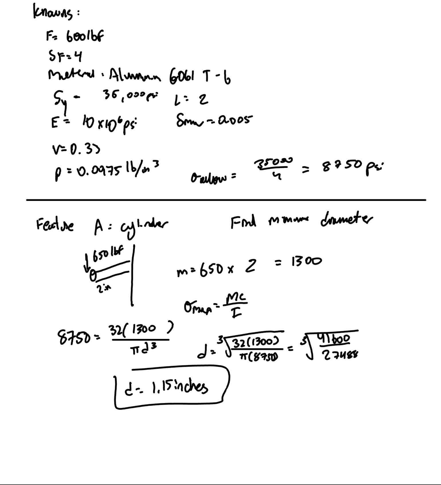
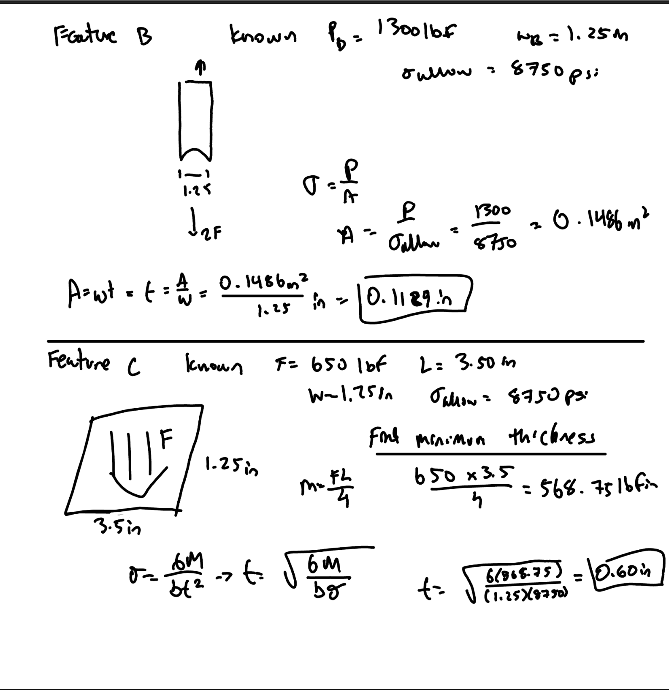
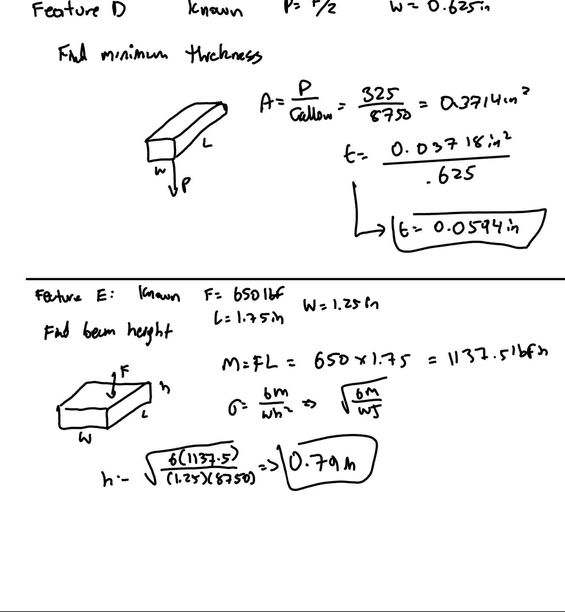
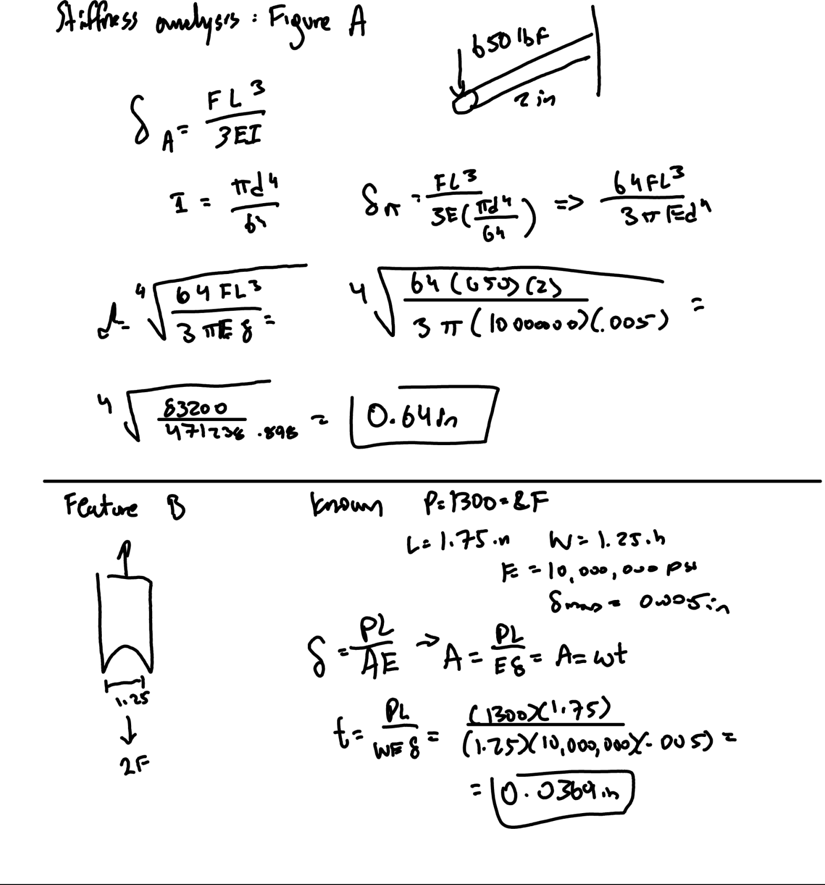
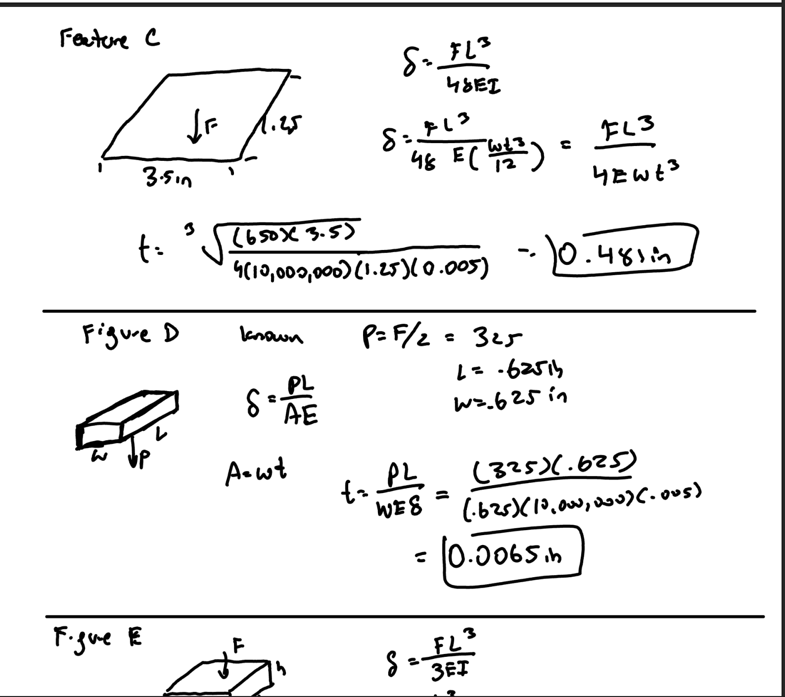
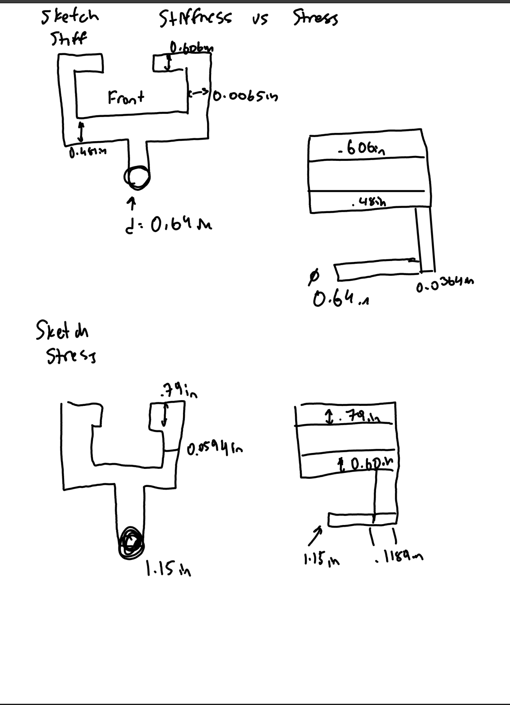

# A5 – Bracket Design

## Objective
Conduct stress analysis to determine appropriate dimensions for structural features.
Generate free body diagrams (FBDs) to visualize forces and constraints for each feature.\
Identify and document known and unknown variables, assumptions, and algebraic models for stress calculations.
Perform stiffness analysis to establish minimum required dimensions based on deflection constraints.
Compare stress and stiffness analyses to ensure structural integrity and compliance with given constraints.
Create detailed multiview sketches illustrating dimensions derived from both stress and stiffness analyses.
Reflect on and document key engineering lessons learned throughout the process.

## Description
Detail design a bracket, using the concept design in Appendix B, to hold a horizontal force applied symmetrically by a strap outline in resource #1. The bracket’s dimensions are designed with different fit classes. Each dimension of the T beam is part of the fit:

“a” intention for use where accuracy is not essential
“b” is about the closest fits that can be expected to run freely
“c” is where accurate location and minimum play is desired

Design using a safety factor of 4 and applied load in between 500 lbf < F < 800 lbf. Choose one of three metals, aluminum 6061 T6, Steel (ASTM A36), or Titanium (Ti-6Al-V4). Furthermore, state assumptions and approximations about the design in order to use fundamental strength of materials analysis. For example, use the proper stress analysis and deflection analysis where appropriate. Assume no failure due to direct shear stress. 

## Dimensions and Calculations

## Feature A

I started my calculations by listing my knowns and unknowns. My allowable stress was 8750 psi. I ended up using 2 inches for my length. With that I was able to find the moment with 650 lbf x 2 in to get 1300 lbfin. Using that value, I used stressmax = Mc/I and rearranging the the inertia equation pi*d^4/64 and solving for the diameter. After the calculations I got d = 1.15 inches.

## Feature B & C

For feature B , I listed the knowns and unknowns. I assumed 2F = 1300 lbf and the width = 1.25in. I did the stress calculation and rearranged to find the area. After that I rearrange A = wt to find the thickness and I ended up getting 0.1189in.

For feature C , the goal was also to find the minimum thickness. The knowns were to 650 lbf and the length of 3.5 inches and the 1.25 inches for the width. Using M = FL/4 I am able to find the moment. From there the inertia formula I = bt^3 /12 is substituted into the stress formula 6M/bt^2. After calculations I got a thickness of 0.60 inches. 

## Feature D & E

Feature D, the goal was to find the minimum thickness. The assumed width was 0.625 inches and I used the same allowed stress. I used the equation A = P/stressallow = 0.0371in^2. And then I took that number and then divided it by 0.625 to get 0.0594 inches.

For feature E, we have to find the beam height. Using the moment formula, I did 650 x 1.75 to get 1137.51lbfin. Rearranging the stress formula gets me 0.79 inches for the height. 

## Stiffness Analysis

## Feature A & B

For feature A, the force is 650 lbf and the length 2 inches that I chose. I also used the material values that were given. Using the deflection formula and the inertia formula, I am able to find the diameter with these constraints and get 0.64 inches. 

For feature B, we use the same knowns and are using the deflection formula to find a new thickness. After doing the calculations I am able to get 0.0369 inches.

## Feature C & D

For feature C, I rearranged the the deflection formula again in order to solve for the thickness of this feature. After calculations, I got 0.491 inches as my answer. 

For D, I used P/F and used the inertia formula I = wh^3/ 12  that to help find the minimum thickness which netted me 0.606 inches. 

## Sketches

## Lessons Learned
Some lessons that I learned are that one bad calculation can set you back a lot since the numbers you use in one calculation are values that you use for the next one. This means that if an error is made early in the process, it can affect multiple calculations later on and change the final dimensions of the design. I learned that it is important to double-check each calculation before using the result in the next step. I also learned that stress and stiffness are both important when designing a part. A part can be strong enough to withstand the applied load but still deflect too much, so both analyses have to be considered when deciding on the final dimensions. For feature A, the stress analysis required a diameter of 1.15 in, while the stiffness analysis only required a diameter of 0.64 in. Since the stress requirement was larger, stress governed the final design. This showed me that a design can meet the stiffness requirement but still not be strong enough to safely support the applied load. Therefore, both stress and stiffness analyses need to be completed before selecting the final dimension.

This assignment took me 5 hours. 
