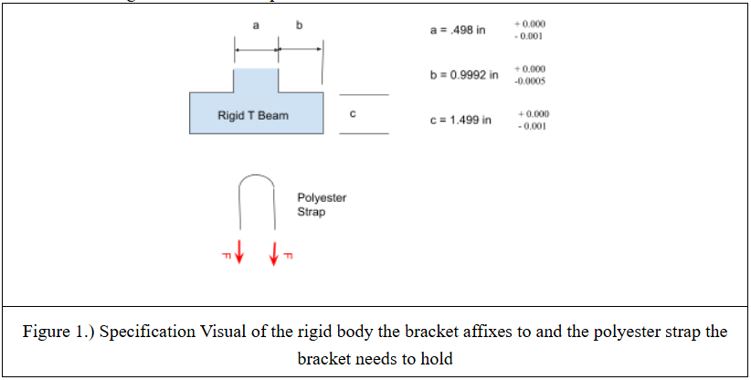
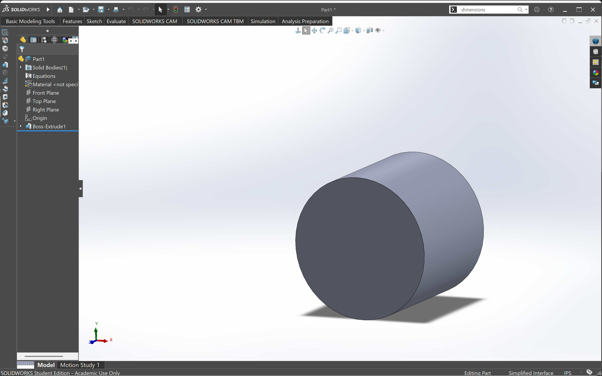
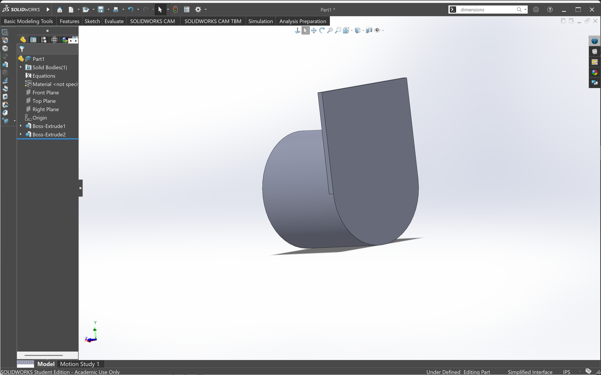
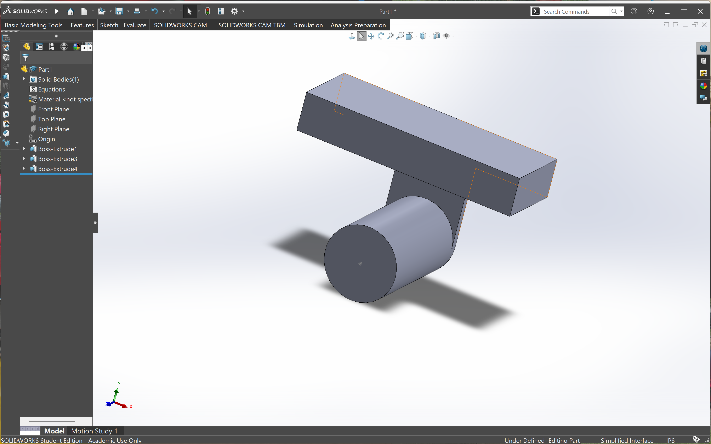
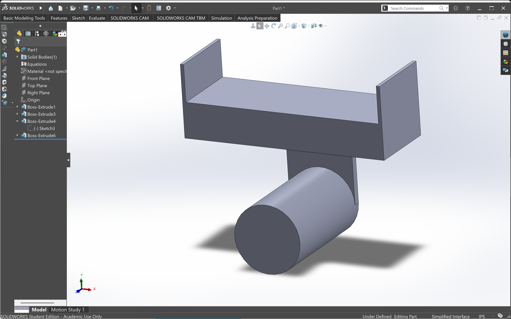
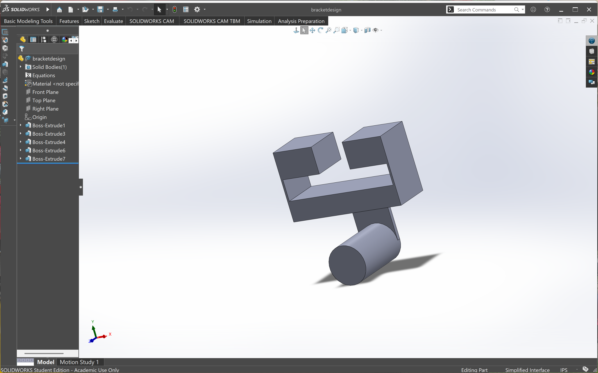
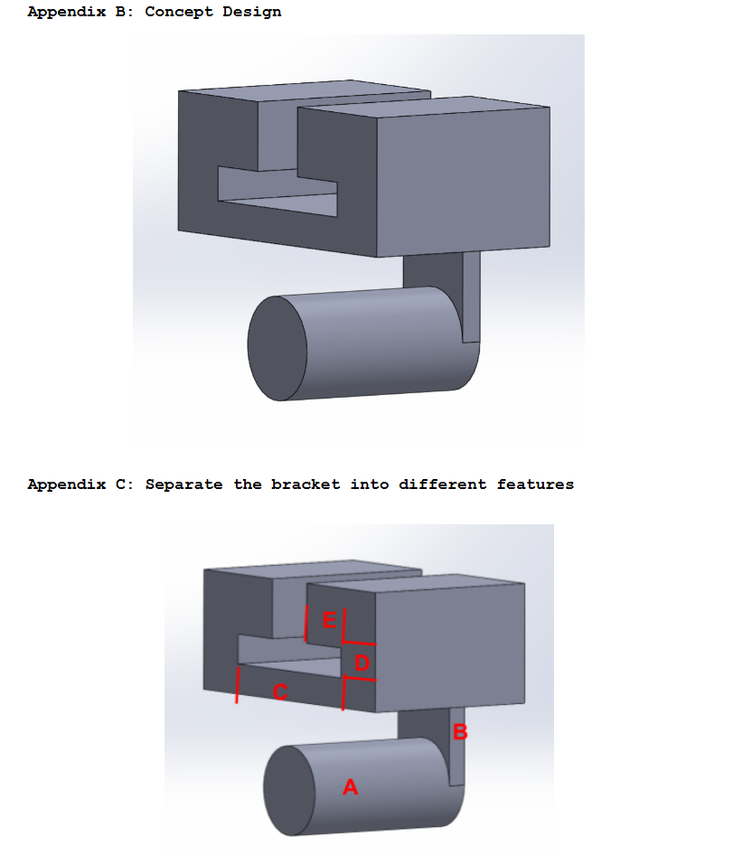
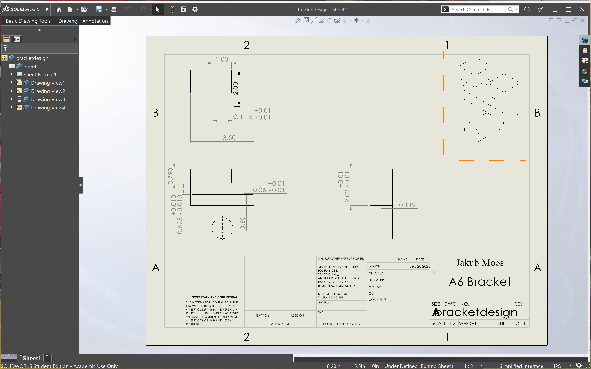

# A6 – Bracket Drawing (Parametric Design)

## Objective
Generate a comprehensive solid model and a multi-view engineering drawing that accurately represents your designed bracket, incorporating all features to ensure both strength and stiffness requirements are met.

## Analyze
I started off my parametric design by using the value 1.15 inches for the diameter that I got from the stress calculations. Then I extruded it using the length value of 2.00 inches which I had chosen in part 1.

Once I had that extruded, it was time to work on the back part that would connect the pin to the rest of the bracket. I started out by drawing a rectangle across the diameter of the pin and then 1.75 inches up. After that I extruded it 0.1189 inches for the thickness

After that was complete I moved onto part c which rested on top of the previous part. I got a length of 3.5 inches and a width of 1.25 inches. Once I got that rectangle set up, it was extruded up 0.60 inches which I had gotten from the stress calculations. 

For part d, which connects part c and e, I used the thickness value 0.0594 which I rounded to 0.06 that I had gotten from the stress calculations. I made that part of the bracket to be 1.00 inches tall. 

Lastly, for part e, I used a height of 0.79 which again was used from the stress calculations and I made it go in 1.25 inches on sides of the bracket leaving a 1.00 inch gap in the middle. Below shows my final parametric design compared to the concept design that was shown in the first part of the assignment. 

 (My completed design)    vs (Conceptual bracket)  

Once I had my final design it was time to make the drawing. I added all the dimensions and tolerances that would be required to remake the part. 

## Engineering Lessons Learned

PART A: For the first part of the bracket design, I used the stress equation for a cantilever beam to determine the dimensions. I calculated the required value using the material yield strength, factor of safety, and applied load. I then manually entered the calculated dimension into SolidWorks rather than connecting the calculation directly to a global variable or equation. The value I calculated for strength was approximately 1.15 inches, while my stiffness calculation resulted in approximately 0.64 inches. Since the strength requirement was bigger, I used the 1.15 inch value. When I changed calculations later in the assignment, I had to manually update the affected dimensions and check the rest of the model. This showed me how using SolidWorks equations and global variables could make future design changes more efficient.

PART B: For the tighter tolerance, I used 0.010 ± 0.001 in on the thin feature because this dimension affects the geometry and function of the bracket, so I wanted to limit change in this area. For my looser tolerance, I used 0.119 in for a non-critical feature. This dimension does not control any mating surfaces or fittings in between components, so I didn't believe it needed the extra tolerances. Using a tighter tolerance on every dimension would increase manufacturing time and cost.

## Communicate
In total this assignment took me about 3 hours. The first 2 hours were making the CAD model and the drawing and the last hour was spent working on the portfolio page. 

## Links to CAD file and drawing:
[PART](bracketdesign.SLDPRT)
[DRAWING](bracketdesign.SLDDRW)

